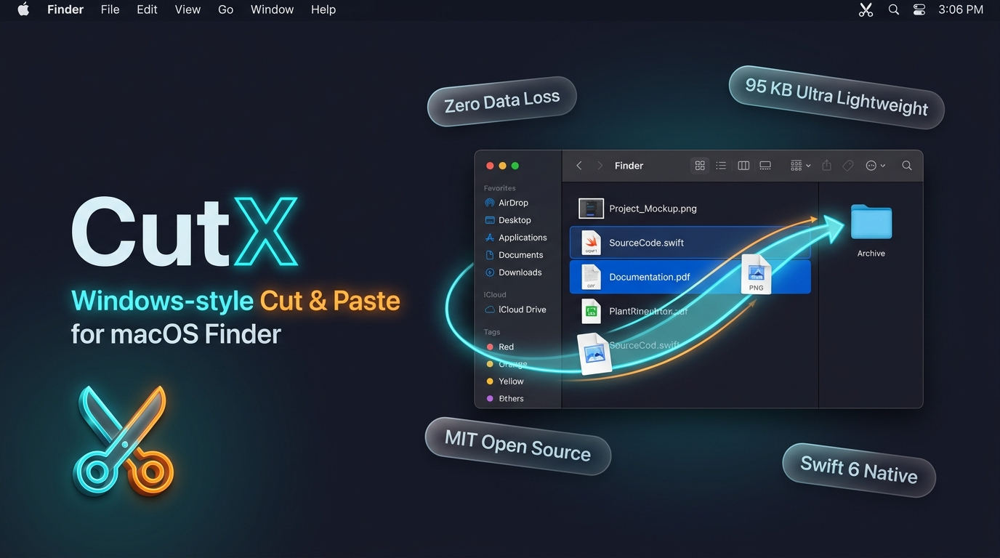
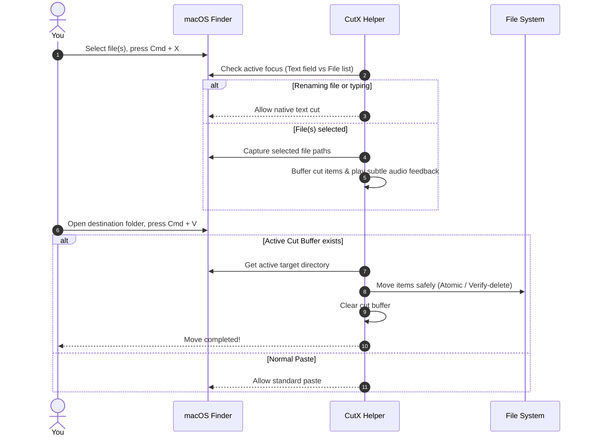

<div align="center">



# ✂️ CutX
### Windows-Style Cut & Paste (`Cmd + X` ➔ `Cmd + V`) for macOS Finder

[](https://apple.com/macos)
[](https://swift.org)
[](./LICENSE)
[](./CONTRIBUTING.md)
[]()

**CutX** brings the familiar, intuitive **Cut & Paste** file management flow to Apple Finder. No more awkward `Option + Cmd + V` finger gymnastics or expensive subscription apps!

[✨ Features](#-features) • [🚀 Quick Start](#-quick-start) • [📖 How It Works](#-how-it-works) • [🛠️ Architecture](#%EF%B8%8F-architecture) • [🤝 Contributing](#-contributing) • [📄 License](#-license)

---

</div>

## 💡 The Problem

In macOS Finder:
* Copy is `Cmd + C`.
* To **Move** files, you must remember and press `Option + Cmd + V`.
* Pressing `Cmd + X` on files or folders produces an error beep.

**CutX fixes this seamlessly**: Press `Cmd + X` to cut selected files/folders, navigate to your destination, and press `Cmd + V` to move them instantly — exactly like Windows Explorer.

---

## ✨ Features

- ✂️ **True `Cmd + X` in Finder**: Cut single or multiple files and folders naturally.
- 🧠 **Smart Context Detection**: Automatically detects when you are renaming a file or typing in a search bar, letting normal text cut pass through without interference.
- ⚡ **Blazing Fast & Lightweight**: 100% native Swift 6 app consuming `< 25MB` RAM with `0%` CPU overhead at idle.
- 🛡️ **Zero Data Loss & Safe Move**:
  - Uses filesystem atomic rename for instant moves on the same drive.
  - Employs copy-verify-delete with hash/size validation across external drives & network volumes.
  - Smart collision handling: auto-renames duplicates (`filename (1).ext`) to prevent accidental overwrites.
- 🔕 **Silent & Clean**: Suppresses macOS Finder error beeps on `Cmd + X` and provides subtle sound/visual confirmation.
- 🔒 **100% Private & Offline**: Zero network calls, no analytics, no tracking, and no keystroke logging.
- 🚀 **Menu Bar Companion**: Minimalist menu bar status with quick toggle, launch-at-login support, and cancel button.

---

## 🚀 Quick Start

### 1. Download & Install
Download the latest `.dmg` or `.app` from [GitHub Releases](https://github.com/sarno/cutX/releases).

1. Open `CutX.dmg`.
2. Drag **CutX** to your **Applications** folder.
3. Launch **CutX**.

### 2. Grant Permissions
CutX requires **Accessibility** permission to detect `Cmd + X` / `Cmd + V` shortcuts specifically in Finder:
1. Open **System Settings** > **Privacy & Security** > **Accessibility**.
2. Enable **CutX**.

---

## 📖 How It Works



---

## 🛠️ Architecture & Tech Stack

CutX is built with a clean, modular architecture:

* **Language**: Swift 6.0
* **UI**: AppKit + SwiftUI (Menu Bar Extra)
* **Event Interception**: `CoreGraphics` (`CGEventTap`) scoped strictly to `com.apple.finder`
* **Finder Introspection**: Accessibility APIs (`AXUIElement`) & AppleEvents (`NSAppleScript`)
* **Service Management**: `SMAppService` for modern macOS Login Item management

Detailed technical documents:
* 📄 [Product Requirements Document (PRD)](./docs/PRD.md)
* 🏗️ [Technical Architecture Blueprint](./docs/ARCHITECTURE_BLUEPRINT.md)
* 🗺️ [Implementation Plan](./docs/PLAN.md)

---

## 🔨 Building from Source

Ensure you have Xcode 15+ and Swift 6 installed:

```bash
# Clone the repository
git clone https://github.com/sarno/cutX.git
cd cutX

# Build release binary
swift build -c release

# Or package into a standalone .app bundle
./Scripts/build_app.sh
```

---

## 🤝 Contributing

Contributions, issues, and feature requests are very welcome!
Feel free to check the [issues page](https://github.com/sarno/cutX/issues) and read our [Contributing Guide](./CONTRIBUTING.md).

1. Fork the Project
2. Create your Feature Branch (`git checkout -b feature/AmazingFeature`)
3. Commit your Changes (`git commit -m 'Add some AmazingFeature'`)
4. Push to the Branch (`git push origin feature/AmazingFeature`)
5. Open a Pull Request

---

## 📄 License

Distributed under the **MIT License**. See [`LICENSE`](./LICENSE) for more information.

<div align="center">
  <sub>Built with ❤️ for the macOS community by <a href="https://github.com/sarno">sarno</a>.</sub>
</div>
