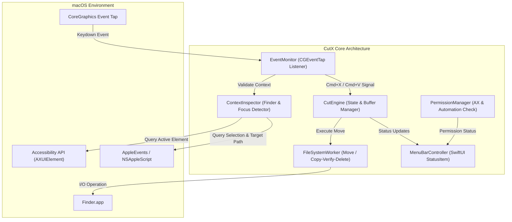

# Technical Architecture Blueprint — CutX

## 1. System Overview
**CutX** dibangun sebagai native macOS application menggunakan **Swift 6** dan framework **AppKit + SwiftUI**. Aplikasi ini menggunakan arsitektur modular event-driven untuk mendengarkan keyboard events secara efisien, menginterogasi state aplikasi Finder, dan mengeksekusi operasi pemindahan file system dengan performa tinggi dan aman.

---

## 2. High-Level Architecture Diagram



---

## 3. Module Breakdown

### 3.1. `PermissionManager`
* **Tanggung Jawab**:
  * Memeriksa status izin Accessibility (`AXIsProcessTrusted()`).
  * Meminta izin jika belum aktif (`AXIsProcessTrustedWithOptions()`).
  * Membuka panel System Settings yang relevan jika pengguna belum memberikan izin.

### 3.2. `EventMonitor` (Keyboard Interceptor)
* **Teknologi**: `CGEvent.tapCreate` pada level `kCGHIDEventTap` atau `kCGAnnotatedSessionEventTap`.
* **Mekanisme**:
  * Menangkap kombinasi modifier key: `Cmd` + `kVK_ANSI_X` (Keycode 7) dan `Cmd` + `kVK_ANSI_V` (Keycode 9).
  * Hanya memproses event jika aplikasi yang sedang aktif (frontmost) adalah `com.apple.finder`.
  * Mengembalikan `nil` (menelan event) saat `Cmd + X` ditangkap pada file selection (mencegah bunyi system beep Finder).
  * Mengembalikan event asli tanpa intervensi jika pengguna sedang berada di luar Finder atau sedang mengedit teks.

### 3.3. `ContextInspector` (Finder Context & Focus Detector)
* **Tanggung Jawab**:
  1. **Deteksi Text Field Fokus**: Menggunakan `AXUIElementCopyAttributeValue` untuk memeriksa apakah elemen yang sedang fokus memiliki role `AXTextField` / `AXTextArea`. Jika ya, shortcut `Cmd + X` dialihkan ke native text cut.
  2. **Pengambilan Seleksi File**: Membaca file/folder yang sedang dipilih di Finder melalui AppleScript / ScriptingBridge (`selection of front Finder window` atau `selection of desktop`).
  3. **Pengambilan Target Directory**: Membaca target folder aktif saat `Cmd + V` ditekan (`target of front Finder window` atau folder desktop jika tidak ada window terbuka).

### 3.4. `CutEngine` (State Management)
* **Tanggung Jawab**:
  * Menyimpan state:
    * `cutItems: [URL]`
    * `timestamp: Date`
    * `sourceWindowID: String?`
  * Reset buffer otomatis jika pengguna melakukan `Cmd + C` (Copy) baru atau setelah `Cmd + V` (Paste) selesai dieksekusi.
  * Memainkan sound feedback (misal `NSSound(named: "Pop")`).

### 3.5. `FileSystemWorker` (File Operations)
* **Tanggung Jawab**:
  * **Same-Volume Move**: Menggunakan `FileManager.default.moveItem(at:to:)` yang memanfaatkan atomic rename filesystem macOS (instan, zero data copy).
  * **Cross-Volume Move**: Jika target berada di volume berbeda, melakukan:
    1. Salin data (`copyItem(at:to:)`).
    2. Verifikasi ukuran & hash file.
    3. Hapus file sumber (`removeItem(at:)`).
  * **Conflict Handling Strategy**:
    * Default: Auto-increment format jika ada nama kembar (misal: `document (1).pdf`).
    * Memberikan callback error/notifikasi jika terjadi kendala izin baca-tulis file.

### 3.6. `MenuBarController` & UI
* **Teknologi**: SwiftUI + `NSStatusItem`.
* **Fitur UI**:
  * Status toggle (Aktif / Jeda).
  * Indikator item yang sedang berada di cut buffer (misal: *"3 file siap dipindahkan"*).
  * Tombol Batal Cut (*Cancel Cut*).
  * Opsi "Launch at Login" via `SMAppService.mainApp`.
  * Tombol Keluar (*Quit*).

---

## 4. Technology Stack & Dependencies

| Komponen | Teknologi | Alasan Pemilihan |
|---|---|---|
| **Language** | Swift 6.0+ | Native, aman memori, performa maksimal, modern concurrency. |
| **Frameworks** | AppKit, SwiftUI, CoreGraphics, ApplicationServices, ServiceManagement | Standar resmi macOS tanpa dependensi pihak ketiga (Zero third-party bloat). |
| **Build System** | Swift Package Manager (SPM) / `xcodebuild` | Standard build tool macOS, mudah diintegrasikan ke CI/CD & Homebrew. |
| **Packaging** | Native App Bundle (`CutX.app`) & DMG (`create-dmg` / `hdiutil`) | Distribusi mudah untuk pengguna umum. |

---

## 5. Security & Privacy Considerations
1. **Accessibility Scoping**: `EventMonitor` hanya mendengarkan keyboard events saat bundle ID adalah `com.apple.finder`. Tidak pernah mencatat atau merekam keystroke di aplikasi lain (keystroke logging protection).
2. **Offline-Only**: Info.plist tidak menyertakan izin jaringan (`NSAppTransportSecurity` / tidak ada network stack), menjamin keamanan 100% data pengguna.
3. **Graceful Error Recovery**: Jika operasi pemindahan file gagal di tengah jalan, status file sumber tidak dihapus untuk mencegah data loss.

---

## 6. Directory Structure Blueprint

```text
cutX/
├── docs/
│   ├── PRD.md
│   └── ARCHITECTURE_BLUEPRINT.md
├── Package.swift
├── Sources/
│   └── CutX/
│       ├── App/
│       │   ├── CutXApp.swift
│       │   └── MenuBarView.swift
│       ├── Core/
│       │   ├── EventMonitor.swift
│       │   ├── ContextInspector.swift
│       │   ├── CutEngine.swift
│       │   └── FileSystemWorker.swift
│       ├── Utils/
│       │   ├── PermissionManager.swift
│       │   ├── SoundHelper.swift
│       │   └── LaunchAtLoginHelper.swift
│       └── Resources/
│           └── Assets.xcassets
├── Scripts/
│   ├── build_app.sh
│   └── create_dmg.sh
└── README.md
```
