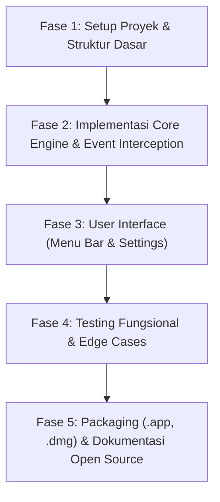

# Implementation Plan — CutX

Rencana eksekusi pengembangan aplikasi **CutX** dibagi menjadi 5 fase terstruktur untuk memastikan aplikasi berjalan stabil, aman, dan siap didistribusikan.

---

## 📋 Ikhtisar Tahapan (Phases)

---

## 🛠️ Detail Rencana Kerja

### Fase 1: Setup Proyek & Struktur Dasar
* [ ] Inisialisasi `Package.swift` dengan target macOS v13+ (Ventura, Sonoma, Sequoia).
* [ ] Menyiapkan struktur folder modular (`Sources/CutX/App`, `Core`, `Utils`, `Resources`).
* [ ] Menyiapkan `Info.plist` (konfigurasi `LSUIElement = true` agar aplikasi berjalan sebagai background/menu bar app tanpa icon dock yang mengganggu).

### Fase 2: Implementasi Core Engine
* [ ] **`PermissionManager`**:
  * Implementasi pengecekan status izin Aksesibilitas (`AXIsProcessTrusted`).
  * Dialog/panduan interaktif jika izin belum diaktifkan.
* [ ] **`ContextInspector`**:
  * Deteksi apakah cursor sedang aktif di text field (rename file/search bar) vs seleksi file Finder.
  * Pembacaan path file yang terseleksi via AppleScript / Scripting Bridge.
  * Pembacaan target folder saat `Cmd + V` ditekan di Finder.
* [ ] **`EventMonitor`**:
  * Implementasi `CGEventTap` untuk menangkap `Cmd + X` dan `Cmd + V` saat Finder aktif.
  * Konsumsi event (menelan error beep bawaan Finder pada `Cmd + X`).
* [ ] **`FileSystemWorker`**:
  * Implementasi atomic move (`FileManager.default.moveItem`) untuk same-volume.
  * Implementasi copy-verify-delete untuk cross-volume (flashdisk / disk eksternal).
  * Resolusi konflik nama file duplikat (auto-numbering format: `filename (1).ext`).
* [ ] **`CutEngine`**:
  * Pengelola state daftar file yang sedang di-cut.
  * Audio feedback saat cut dan paste.
  * Mekanisme pembatalan jika pengguna menekan Escape atau melakukan copy baru.

### Fase 3: User Interface & Menu Bar
* [ ] **`MenuBarView` & `CutXApp`**:
  * Status Item di Menu Bar dengan ikon gunting/CutX.
  * Indikator visual jumlah file yang siap dipindahkan.
  * Menu dropdown:
    * Status: Aktif / Jeda.
    * Tombol "Batalkan Cut".
    * Pilihan "Launch at Login" (Otomatis jalan saat Mac dinyalakan).
    * Bantuan & Izin Aksesibilitas.
    * Keluar (*Quit*).

### Fase 4: Testing & Verifikasi Edge Cases
* [ ] Tes potong & tempel 1 file.
* [ ] Tes potong & tempel banyak file dan folder sekaligus.
* [ ] Tes bypass: Memastikan `Cmd + X` untuk teks (rename file) tetap berfungsi normal sebagai cut text.
* [ ] Tes penanganan file duplikat (menghindari data tertimpa).
* [ ] Tes pemindahan antar disk/partisi yang berbeda.

### Fase 5: Packaging & Distribusi
* [ ] Script otomatisasi build bundle `.app` (`Scripts/build_app.sh`).
* [ ] Script pembuatan installer disk image `.dmg` (`Scripts/create_dmg.sh`).
* [ ] Dokumentasi lengkap `README.md` (Panduan instalasi, cara pakai, dan lisensi MIT).

---

## ⏱️ Target Output
1. Aplikasi executable `CutX.app` yang siap dijalankan langsung di macOS.
2. File installer `CutX.dmg` yang siap di-share ke teman / publik.
3. Repositori open-source yang rapi dan siap dipublish ke GitHub.
