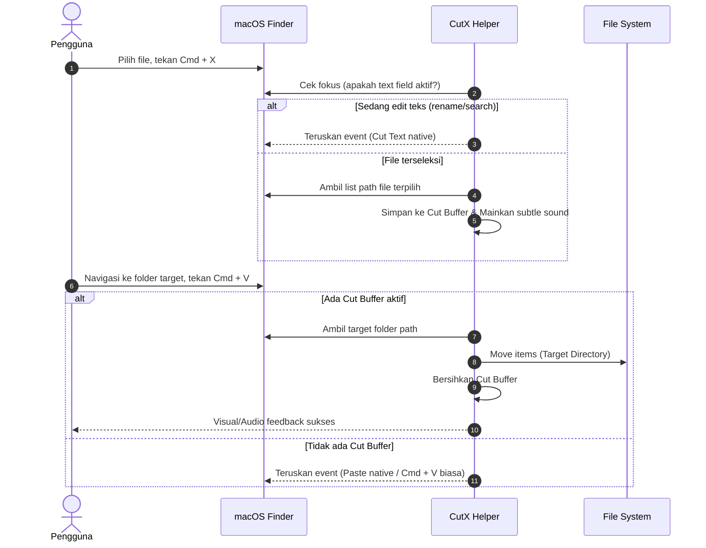

# Product Requirements Document (PRD) — CutX

## 1. Executive Summary
**CutX** adalah utilitas macOS native (Swift/SwiftUI) yang menghadirkan pengalaman intuitif cut & paste file/folder (`Cmd + X` lalu `Cmd + V`) seperti pada sistem operasi Windows langsung ke dalam Apple Finder, tanpa memerlukan aplikasi pihak ketiga berbayar yang berat.

Aplikasi ini dirancang untuk berjalan ringan di background / Menu Bar, open-source, hemat daya, serta mengutamakan integritas dan keamanan data file pengguna.

---

## 2. Problem Statement
* **Perilaku Default macOS Finder**:
  * Pengguna menyalin file dengan `Cmd + C`.
  * Untuk memindahkan file (*move*), pengguna harus menekan kombinasi `Option + Cmd + V`.
  * Menekan `Cmd + X` pada file/folder di Finder tidak melakukan apa-apa (hanya membunyikan sistem error beep).
* **Pain Point Pengguna**:
  * Banyak pengguna (terutama eks-pengguna Windows atau pengguna lintas OS) terbiasa dengan alur `Ctrl + X` -> `Ctrl + V`.
  * Aplikasi alternatif yang ada di pasar umumnya berbayar (subscription/one-time fee mahal) atau terikat pada package suite utilitas besar yang berat (bloatware).

---

## 3. Goals & Non-Goals

### 3.1. Goals
1. **Seamless Cut & Paste**: Memungkinkan shortcut `Cmd + X` pada seleksi file di Finder, lalu `Cmd + V` di folder tujuan untuk memindahkan file secara otomatis (*move*).
2. **Smart Context Detection**: Membedakan secara cerdas antara pemotongan teks (misal: saat sedang rename file di Finder) vs pemotongan item file/folder.
3. **Cross-Volume & Conflict Handling**: Mendukung pemindahan file antar folder di drive lokal, cloud storage (iCloud/Dropbox/Google Drive), dan eksternal USB drive dengan penanganan konflik nama file yang aman.
4. **Lightweight & Native**: Memory footprint kecil (< 30 MB RAM), zero CPU overhead saat idle, startup instan.
5. **Open Source & Privacy-Friendly**: 100% offline, tanpa tracking/telemetri, mudah di-compile dan dibagikan (gratis).

### 3.2. Non-Goals
* Menggantikan total Finder dengan window manager baru.
* Menyediakan fitur sinkronisasi file cloud mandiri (hanya mengandalkan file system lokal/mounted).

---

## 4. User Personas
* **Switcher / Windows-to-Mac User**: Terbiasa dengan mental model `Ctrl + X` dan frustrasi dengan kombinasi `Option + Cmd + V`.
* **Power User / Designer / Developer**: Menginginkan utilitas menu bar minimalis, ringan, open-source, dan dapat dikustomisasi.

---

## 5. Key Features & Functional Requirements

| ID | Fitur | Deskripsi | Prioritas |
|---|---|---|---|
| **FR-01** | **Finder `Cmd + X` Interception** | Menangkap shortcut `Cmd + X` hanya ketika window/desktop Finder sedang aktif dan ada file/folder yang terseleksi. | P0 (Core) |
| **FR-02** | **File Cut State & Clipboard Buffer** | Menyimpan daftar URL file/folder yang di-cut ke dalam state internal memory & pasteboard khusus. | P0 (Core) |
| **FR-03** | **Finder `Cmd + V` Move Execution** | Saat `Cmd + V` ditekan di Finder, jika ada state cut aktif, pindahkan (*move*) file ke folder Finder yang sedang aktif/terbuka. | P0 (Core) |
| **FR-04** | **Text-Edit Bypass** | Jika pengguna sedang mengedit teks (misal sedang rename nama file di Finder atau mengetik di search bar Finder), biarkan `Cmd + X` dan `Cmd + V` berjalan sebagai text edit biasa. | P0 (Core) |
| **FR-05** | **Visual / Audio Feedback** | Memberikan feedback ringkas (suara subtle atau notifikasi transisi) saat file berhasil di-cut dan saat berhasil di-paste. | P1 |
| **FR-06** | **Menu Bar App & Settings** | Ikon di menu bar untuk status On/Off, panduan izin Accessibility, Launch at Login, dan shortcut konfigurasi. | P1 |
| **FR-07** | **Conflict Resolution** | Logika penanganan jika file dengan nama sama sudah ada di folder tujuan (opsi: Rename/Auto-increment `file (1).ext`, Overwrite, atau Ask). | P1 |
| **FR-08** | **Cross-Volume Fallback** | Jika memindahkan antar drive/volume berbeda (di mana atomic rename/move tidak didukung), lakukan copy + verify + delete source secara aman. | P1 |

---

## 6. User Experience & Flows

### 6.1. Main Workflow (Cut & Paste)

### 6.2. Onboarding & Permission Flow
1. Saat pertama kali dibuka, CutX memeriksa izin **Accessibility (Izin Aksesibilitas)**.
2. Menampilkan panduan visual jika izin belum aktif, dengan tombol langsung membuka `System Settings > Privacy & Security > Accessibility`.
3. Setelah izin diberikan, CutX otomatis aktif dan menetap di Menu Bar.

---

## 7. Non-Functional Requirements
* **Platform Support**: macOS 13 (Ventura), macOS 14 (Sonoma), macOS 15 (Sequoia) dan versi di atasnya (Apple Silicon M1/M2/M3/M4 & Intel).
* **Performance**: Intercept latency < 5ms (tidak boleh ada jeda terasa saat mengetik atau menggunakan Finder).
* **Security & Privacy**: Zero network access (App Sandbox / Non-networked), tidak ada data tracking.
* **Packaging**: Standalone `.app` bundle, compressed `.dmg`, dan installer script Homebrew.

---

## 8. Success Metrics
* Pengguna dapat memotong dan memindahkan 1 atau ratusan file sekaligus tanpa error dan tanpa resiko data hilang.
* Memory usage < 25 MB.
* 100% kompatibilitas dengan shortcut standar Finder lainnya.
